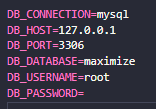

## Sobre o projeto
- Este projeto fora criado como um teste para a vaga de Desenvolvedor Back End na MAXIMIZE.
- Esta aplicação visa a criação de um Feed de notícias utilizando uma API.
- A aplicação está utilizando Laravel 7.x e PHP 7.3.33.

### 📋 Pré-requisitos

- PHP 7.3.33
- Composer
- Node 20.10.0 (versões recentes)


## Como rodar o projeto
- Após clonar o projeto utilizar os comandos:

- 1 - ```composer require laravel/ui:^2.4```
- 2 - npm install
- 3 - npm run dev (desenvolvimento) ou npm run production (produção)
- 4 - php artisan storage:link (faz um link para o local que está sendo salvo as imagens)
- 5 - composer require tymon/jwt-auth (autenticação token)
- 6 - Caso seu projeto não venha com o .env você deverá crialo na raiz do projeto
- 7 - php artisan jwt:secret (cria uma chave token no .env)
- 8 - php artisan migrate:fresh --seed (para puxar localmente todas as tabelas do banco.)
- 9 - php artisan serve (Para rodar o projeto)
- Obs: Caso esteja rodando em ambiente de desenvolvimento no Google Chrome é recomendado que baixe a extensão para Vue.js nesse link:
https://devtools.vuejs.org/guide/installation.html

## Credenciais
- Login: dev@dev.com
- Password: 123

## Database
- Criar em seu localhost uma nova Database
- Em seguida coloque o nome da Database criada no seu .env no campo 'DB_DATABASE' da seguinte forma: 



- Rodar o comando 'php artisan migrate:fresh --seed' para puxar localmente todas as tabelas do banco.

## Toda a documentação de como instalar o JWT em seu projeto pode ser vista aqui:

- https://jwt-auth.readthedocs.io/en/develop/laravel-installation/ (instalar no projeto)

- https://jwt-auth.readthedocs.io/en/develop/quick-start/ (quick start)

